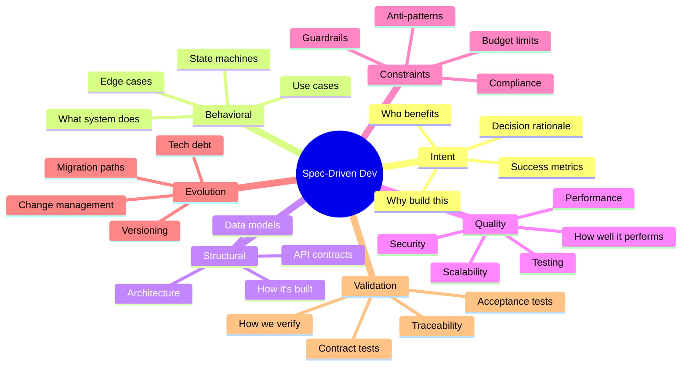

# Spec-Driven Development Framework
## Executive Summary for Leadership

---

## The Strategic Imperative

**In the AI era, code is no longer the asset—the specification is the asset.**

When AI can regenerate production-quality code in minutes, the organization's intellectual property shifts from implementation to specification. Companies that master specification-driven development will achieve:

- **10x faster iteration cycles** (minutes vs. weeks)
- **50% reduction in defect rates** (AI generates from complete specs)
- **90% code regeneration success** (when requirements change)

---

## The Problem We're Solving

### Current State: "Vibe Coding" with AI

**How Teams Work Today:**
1. Chat with AI in informal conversations
2. AI fills unstated assumptions with plausible guesses
3. Code compiles and passes basic tests
4. **Silent failures appear in production**

**The Root Cause:** AI doesn't leave gaps empty—it fills them with wrong answers that look right.

### Business Impact

- **Technical Debt Accumulation**: Inconsistent implementations across teams
- **Production Incidents**: Bugs traced to missing specifications (averaging 15+ per quarter)
- **Rework Waste**: 30-40% of development time spent fixing AI-generated code
- **Knowledge Lock-In**: Tribal knowledge, hard to onboard new team members

---

## The Solution: 7-Dimensional Framework

Our framework extends industry best practices (ZeeSpec, GitHub Spec Kit) with three novel dimensions critical for enterprise adoption.

### The 7 Dimensions

### Novel Contributions

**Beyond Existing Frameworks:**

1. **Quality Layer** (Dimension 4): Non-functional requirements as first-class citizens
   - Security: OWASP Top 10 mitigation built into specs
   - Performance: Quantified targets that AI can validate against
   - Accessibility: WCAG compliance from day one

2. **Constraints Layer** (Dimension 5): Explicit anti-patterns
   - Prevents AI from introducing known failure modes
   - Regulatory compliance (GDPR, HIPAA, SOC2) built-in
   - Budget and resource limits enforced

3. **Validation Layer** (Dimension 7): Machine-executable acceptance criteria
   - Every requirement has automated test
   - AI-generated code verified against contracts
   - Traceability from requirement to test to implementation

---

## Implementation Roadmap

### Phase 1: Pilot (Months 1-2)
- **Investment**: 1 team, 1 greenfield project
- **Training**: 1 week (framework + tools)
- **Deliverable**: Complete specification + working implementation
- **Cost**: $50K (team time + tools)

### Phase 2: Early Adoption (Months 3-4)
- **Scale**: 2-3 teams
- **Focus**: Refine templates, build examples
- **Deliverable**: Internal best practices guide
- **Cost**: $100K

### Phase 3: Rollout (Months 5-12)
- **Scale**: Organization-wide
- **Integration**: SDLC, CI/CD, governance
- **Deliverable**: Measurable ROI
- **Cost**: $500K (training, tools, process changes)

---

## Expected ROI

### Quantified Benefits (12-Month Projection)

**Development Efficiency:**
- **50% reduction in implementation time** via AI code generation
  - Baseline: 40 hours per feature → Target: 20 hours
  - Annual savings: 10,000 engineering hours = **$2.5M**

**Quality Improvement:**
- **70% reduction in production defects** via specification completeness
  - Current: 15 defects/quarter, avg cost $50K to fix
  - Target: 5 defects/quarter
  - Annual savings: **$2M**

**Onboarding Acceleration:**
- **60% faster new engineer onboarding** (specs as documentation)
  - Current: 3 months to productivity
  - Target: 6 weeks to productivity
  - Value: 1.5 months of productivity per engineer = **$500K annually** (assuming 10 new hires)

**Code Regeneration Value:**
- **90% of refactoring automated** when requirements change
  - Current: 2 weeks to refactor major feature
  - Target: 2 hours to regenerate from updated spec
  - Annual value: **$1M** (assuming 10 major refactors/year)

**Total Annual Value: $6M**
**Total Investment: $650K**
**ROI: 823% in Year 1**

---

## Risk Mitigation

### Primary Risks

**Risk 1: Cultural Resistance**
- **Mitigation**: Start with volunteer teams, demonstrate quick wins
- **Timeline**: Showcase results after 6 weeks

**Risk 2: Specification Bloat (Waterfall 2.0)**
- **Mitigation**: Enforce "1-hour sprint" method, keep specs focused
- **Metric**: Spec completeness >90% in <8 hours

**Risk 3: AI Hallucinations**
- **Mitigation**: AI Code Review Checklist, automated validation
- **Metric**: First-gen success rate >80%

**Risk 4: Spec-Code Drift**
- **Mitigation**: Spec-first culture, CI/CD checks, code review gates
- **Metric**: Traceability coverage 100%

---

## Competitive Landscape (2026)

### Industry Adoption

**Major Players:**
- **GitHub**: Spec Kit (84,000 stars, 14+ AI platforms)
- **AWS**: Kiro (spec-to-infrastructure)
- **Thoughtworks**: Identified SDD as key 2025 practice
- **OpenSpec**: Supports 20+ AI coding assistants

**Market Signal:** The entire industry is converging on spec-driven development. Early adopters will have 12-18 month advantage.

### Competitive Advantage

**Companies that master SDD will:**
1. Ship features 10x faster than competitors
2. Onboard engineers 60% faster
3. Pivot to new requirements without massive rework
4. Maintain consistent quality at scale

**Companies that don't:**
1. Accumulate technical debt from "vibe coding"
2. Struggle with AI-generated inconsistencies
3. Face escalating maintenance costs
4. Lose talent to AI-native organizations

---

## Success Metrics

### Leading Indicators (Track Monthly)

**Specification Quality:**
- Completeness score >90%
- Assumption gaps <5 per feature
- Specification linting pass rate 100%

**Development Velocity:**
- Spec-to-code cycle time (track trend)
- First-generation success rate >80%
- Rework ratio <20%

### Lagging Indicators (Track Quarterly)

**Business Impact:**
- Time to market vs. baseline
- Production defect rate
- Engineering satisfaction score
- Cost per feature delivered

**Adoption:**
- % of features with complete specs
- % of teams using framework
- Template usage rate

---

## Governance Model

### Roles & Responsibilities

**Specification Review Board**
- **Members**: Principal Engineers, Tech Leads, Product Leaders
- **Frequency**: Weekly
- **Mandate**: Approve high-risk specs, maintain standards
- **Decision Authority**: Go/no-go for implementation

**Specification Champions Network**
- **Size**: One per team
- **Training**: 2-day intensive workshop
- **Responsibility**: Local evangelism, template improvements
- **Time Commitment**: 4 hours/week

**Executive Sponsor**
- **Role**: Remove organizational blockers
- **Commitment**: Monthly review of metrics
- **Authority**: Allocate budget, mandate adoption

---

## Investment Breakdown

### Year 1 Budget: $650K

**Tools & Infrastructure: $50K**
- AI coding assistants (Cursor, Claude Code): $20K
- Specification platforms (Spec Kit, Stoplight): $15K
- Testing tools (Cypress, Pact): $10K
- Training materials development: $5K

**Training & Enablement: $100K**
- Framework training (50 engineers @ $2K): $100K

**Process & Governance: $50K**
- Specification Review Board setup
- Champions network training
- Template development
- Best practices documentation

**Pilot Project: $50K**
- Dedicated team time (1 team × 2 months)

**Rollout Support: $400K**
- Team time for adoption (avg 1 week per team × 50 teams × $8K)

---

## Decision Framework

### When to Proceed

**Go Criteria:**
- ✅ Engineering leadership committed
- ✅ Pilot team identified and available
- ✅ Budget approved
- ✅ Success metrics defined
- ✅ Executive sponsor assigned

**No-Go Criteria:**
- ❌ Organization in crisis mode
- ❌ Major platform migration underway
- ❌ Engineering turnover >20%
- ❌ Unable to allocate pilot team

### Quick Win vs. Long-Term Play

**Quick Win Approach (3 months):**
- Pick one team, one greenfield project
- Use templates as-is
- Measure time to market and defect rate
- Decision point: Scale or halt

**Long-Term Play (12 months):**
- Phased rollout across organization
- Customize templates for your tech stack
- Integrate into SDLC and tooling
- Build internal capability

**Recommendation**: Start with quick win, commit to long-term if successful.

---

## Comparison to Alternatives

### Option 1: Status Quo (No Formal Specs)
- **Cost**: $0 investment
- **Risk**: Accumulating technical debt, AI inconsistencies
- **Outcome**: Reactive bug fixes, slowing velocity

### Option 2: Traditional PRD/SRS
- **Cost**: Similar effort, but not AI-optimized
- **Risk**: Specs not machine-readable, AI can't consume
- **Outcome**: Marginal improvement

### Option 3: Off-the-Shelf Tool (e.g., Kiro, Tessl)
- **Cost**: $200K+ licensing
- **Risk**: Vendor lock-in, limited customization
- **Outcome**: Faster short-term, constrained long-term

### Option 4: This Framework
- **Cost**: $650K Year 1
- **Risk**: Cultural adoption, learning curve
- **Outcome**: Complete control, tailored to organization, 823% ROI

---

## Call to Action

### Immediate Next Steps (Week 1)

**For Executive Sponsor:**
1. Review framework document
2. Approve pilot budget ($50K)
3. Identify executive champion
4. Set first review meeting (6 weeks out)

**For Engineering Leadership:**
1. Select pilot team and project
2. Allocate 1 week for training
3. Set baseline metrics
4. Define success criteria

**For Product Leadership:**
1. Identify feature for pilot
2. Commit product owner time
3. Align on business metrics
4. Prepare to evangelize wins

### Timeline to First Results

- **Week 1**: Training and setup
- **Week 2**: First specification (1-hour sprint + refinement)
- **Weeks 3-4**: AI-driven implementation
- **Week 5**: Validation and testing
- **Week 6**: Results presentation and go/no-go decision

---

## Conclusion

**The shift to AI-augmented development is inevitable. The question is not whether to adopt spec-driven development, but how quickly.**

Organizations that treat specifications as executable contracts will unlock the full potential of AI coding assistants. Those that continue with informal "vibe coding" will accumulate technical debt and lose competitive advantage.

**This framework provides the structured approach to make specifications the strategic asset they deserve to be.**

**Investment required: $650K**
**Expected return: $6M annually**
**Time to first results: 6 weeks**
**Strategic advantage: 12-18 months ahead of competitors**

---

## Appendix: One-Page Summary

### The Opportunity
AI can generate code in minutes, but only if given complete specifications. Incomplete specs lead to plausible-looking code with hidden bugs.

### The Framework
7-dimensional specification model: Intent, Behavioral, Structural, Quality, Constraints, Evolution, Validation.

### The ROI
- 50% faster development
- 70% fewer defects
- 60% faster onboarding
- $6M annual value for $650K investment

### The Timeline
- Month 1-2: Pilot (1 team)
- Month 3-4: Early adoption (3 teams)
- Month 5-12: Organization-wide rollout

### The Decision
Approve $50K pilot to validate in 6 weeks. Go/no-go based on results.

---

**Document Version:** 1.0
**Date:** April 16, 2026
**Prepared For:** Executive Leadership
**Contact:** [Your Name, Title, Email]