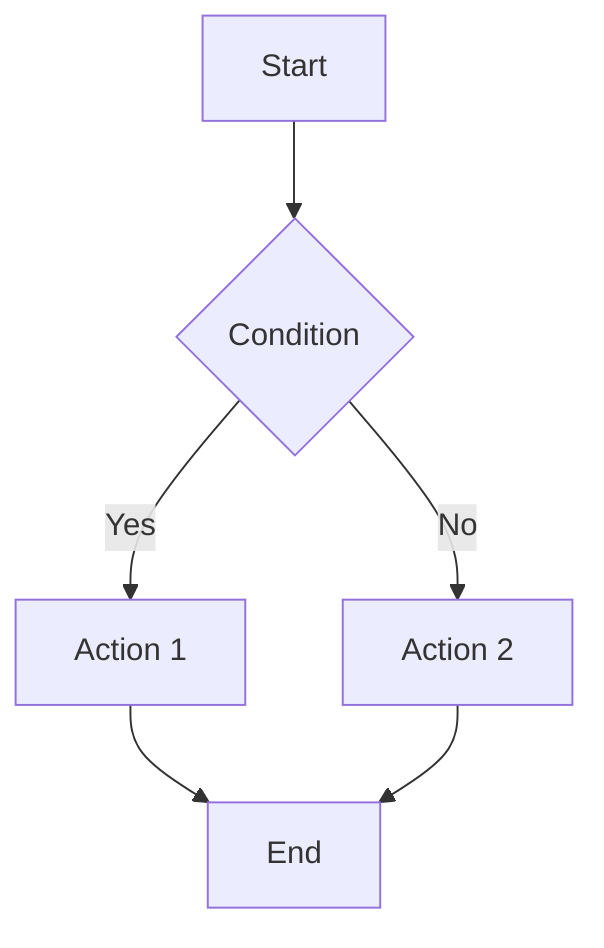
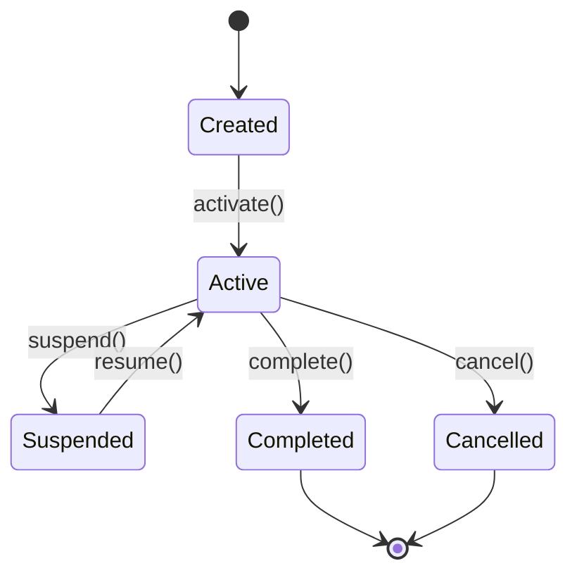
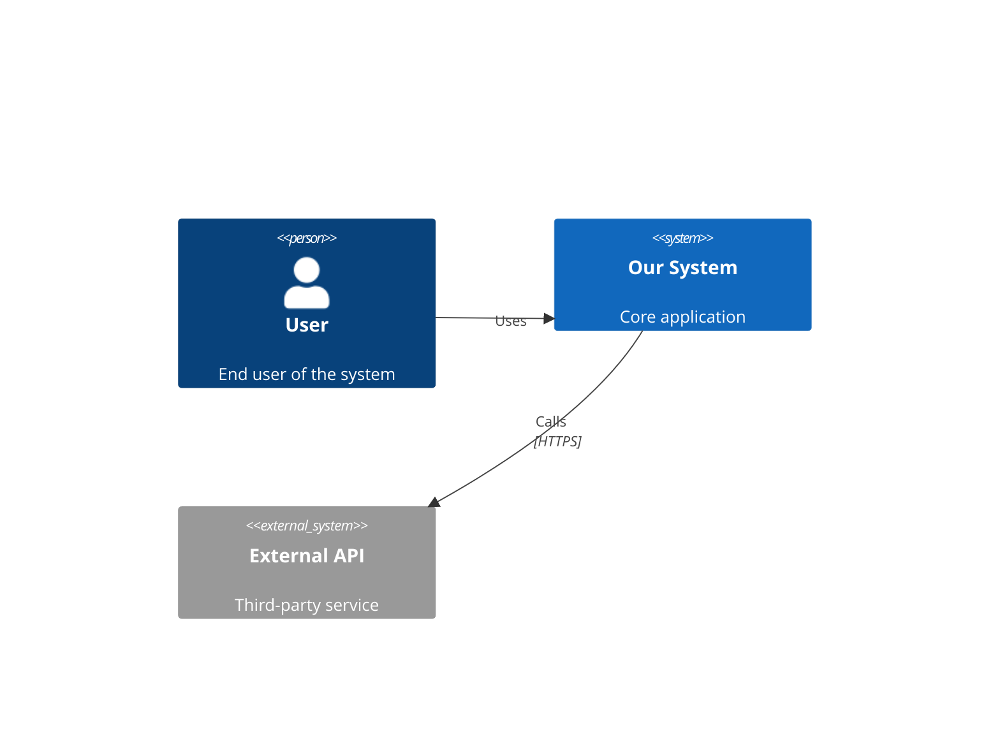
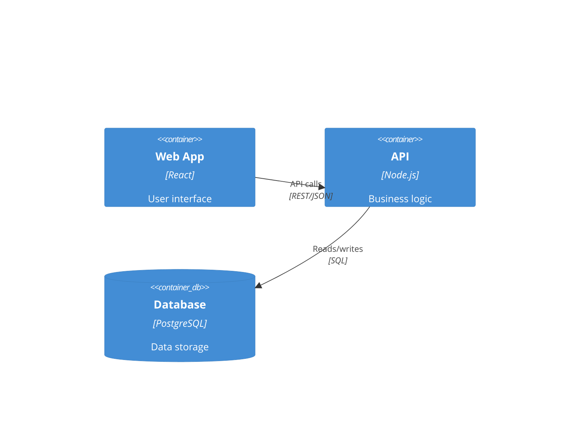
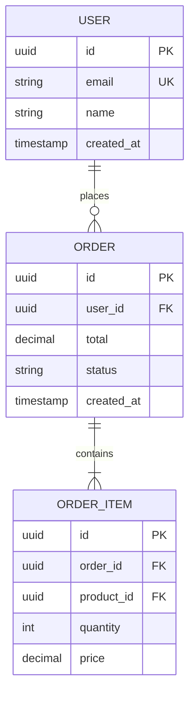
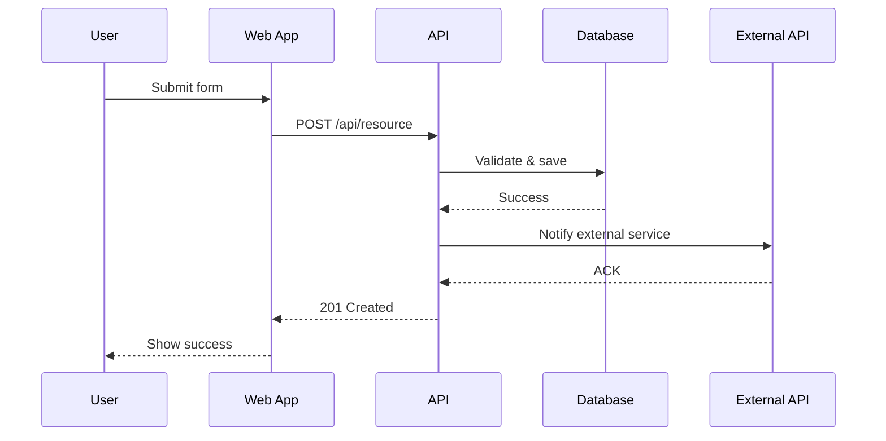

# Specification Template: 7-Dimensional Framework

**Project Name:** [Your Project]
**Version:** 0.1.0
**Date:** [YYYY-MM-DD]
**Owner:** [Name]

---

## Dimension 1: INTENT Layer

### Business Objective
**Problem Statement:**
[What business problem are we solving? What's the cost of not solving it?]

**Desired Outcome:**
[What success looks like in business terms]

**OKRs:**
- Objective: [Qualitative goal]
  - KR1: [Measurable result]
  - KR2: [Measurable result]
  - KR3: [Measurable result]

### User Personas

**Primary Persona: [Name]**
- Role: [Job title/role]
- Goals: [What they want to achieve]
- Pain Points: [Current frustrations]
- Jobs-to-be-Done: [What they're hiring this product to do]

**Secondary Personas:**
- [Additional personas as needed]

### Success Metrics
- **Usage:** [DAU, MAU, engagement rate]
- **Business:** [Revenue, conversion, cost reduction]
- **Quality:** [Error rate, performance, satisfaction]
- **Adoption:** [Time to value, retention rate]

### Key Decision Log
| Decision | Rationale | Alternatives Considered | Date |
|----------|-----------|------------------------|------|
| [Choice made] | [Why] | [What we didn't pick] | YYYY-MM-DD |

---

## Dimension 2: BEHAVIORAL Layer

### Functional Requirements (EARS Format)

**Ubiquitous Requirements:**
- REQ-001: System SHALL [requirement]
- REQ-002: System SHALL [requirement]

**Event-Driven Requirements:**
- REQ-010: WHEN [trigger] THEN system SHALL [response]
- REQ-011: WHEN [trigger] IF [condition] THEN system SHALL [response]

**State-Driven Requirements:**
- REQ-020: WHILE [state] system SHALL [requirement]

**Optional Requirements:**
- REQ-030: WHERE [feature included] system SHALL [requirement]

### Use Cases

**UC-001: [Use Case Name]**
- **Actor:** [Primary user]
- **Goal:** [What they want to achieve]
- **Preconditions:**
  - [State before use case starts]
- **Trigger:** [What initiates this use case]
- **Main Success Scenario:**
  1. [Step 1]
  2. [Step 2]
  3. [System response]
  4. [Step 4]
- **Extensions/Alternatives:**
  - 2a. If [condition]: [alternative flow]
- **Postconditions:**
  - [State after successful completion]
- **Exceptions:**
  - EX-001: If [error condition] THEN [error handling]

### User Flows



### State Machines



### Edge Cases & Error Scenarios
- **EC-001:** [Boundary condition] → [Expected behavior]
- **EC-002:** [Null/empty input] → [Expected behavior]
- **EC-003:** [Concurrent operations] → [Expected behavior]
- **ERR-001:** [Error type] → [Error message + recovery action]

### Temporal Constraints
- **Timeouts:** [Operation must complete within X seconds]
- **Schedules:** [Batch job runs at 2 AM daily]
- **Sequences:** [Order of operations that must be preserved]

---

## Dimension 3: STRUCTURAL Layer

### System Architecture

**Context Diagram (C4 Level 1):**


**Container Diagram (C4 Level 2):**


**Component Diagram (C4 Level 3):**
[Detailed internal components of each container]

### Data Model

**Entity-Relationship Diagram:**


**Schema Definitions:**
```sql
CREATE TABLE users (
    id UUID PRIMARY KEY DEFAULT gen_random_uuid(),
    email VARCHAR(255) UNIQUE NOT NULL,
    name VARCHAR(255) NOT NULL,
    created_at TIMESTAMP DEFAULT NOW(),
    CONSTRAINT email_format CHECK (email ~* '^[A-Za-z0-9._%+-]+@[A-Za-z0-9.-]+\.[A-Z|a-z]{2,}$')
);
```

### API Specification

**OpenAPI/REST:**
```yaml
openapi: 3.0.0
paths:
  /api/v1/users:
    post:
      summary: Create new user
      requestBody:
        required: true
        content:
          application/json:
            schema:
              type: object
              required: [email, name]
              properties:
                email:
                  type: string
                  format: email
                name:
                  type: string
                  minLength: 2
      responses:
        '201':
          description: User created
          content:
            application/json:
              schema:
                $ref: '#/components/schemas/User'
        '400':
          description: Invalid input
```

**GraphQL Schema:**
```graphql
type User {
  id: ID!
  email: String!
  name: String!
  orders: [Order!]!
  createdAt: DateTime!
}

type Query {
  user(id: ID!): User
  users(limit: Int = 10, offset: Int = 0): [User!]!
}

type Mutation {
  createUser(input: CreateUserInput!): User!
}
```

### Technology Stack

| Layer | Technology | Version | Rationale |
|-------|------------|---------|-----------|
| Frontend | React | 18.x | Component reusability, ecosystem |
| Backend | Node.js | 20 LTS | JavaScript full-stack, async I/O |
| Database | PostgreSQL | 16.x | ACID compliance, JSON support |
| Cache | Redis | 7.x | Fast in-memory operations |
| Queue | RabbitMQ | 3.12 | Reliable message delivery |

### Integration Points

**External Services:**
- **Service:** Stripe Payment API
  - **Protocol:** REST/HTTPS
  - **Authentication:** API Key
  - **Endpoints:** `/v1/charges`, `/v1/customers`
  - **Error Handling:** Retry with exponential backoff (max 3 attempts)

### Sequence Diagrams



---

## Dimension 4: QUALITY Layer

### Performance Requirements

**Response Time Targets:**
- API endpoints: < 200ms (p95), < 500ms (p99)
- Page load (first contentful paint): < 1.5s (p95)
- Database queries: < 100ms (p95)
- Background jobs: Complete within 5 minutes

**Throughput Targets:**
- API: 1000 requests/second sustained
- Database: 5000 transactions/second
- Concurrent users: 10,000 simultaneous

**Resource Limits:**
- Memory per container: < 512MB
- CPU per container: < 1 core
- Database connections: Max 100 per instance

### Security Requirements

**Authentication:**
- Mechanism: OAuth 2.0 + JWT
- Token expiry: 24 hours (access), 30 days (refresh)
- MFA: Required for admin roles

**Authorization:**
- Model: RBAC (Role-Based Access Control)
- Principle: Least privilege
- Roles: [List roles and permissions]

**Data Protection:**
- Encryption in transit: TLS 1.3
- Encryption at rest: AES-256
- PII handling: Hash email, encrypt SSN
- Password storage: bcrypt (cost factor 12)

**OWASP Top 10 Mitigation:**
- A01 Broken Access Control: Enforce authorization checks on all endpoints
- A02 Cryptographic Failures: Use TLS 1.3, validate certificates
- A03 Injection: Parameterized queries, input validation
- A04 Insecure Design: Threat modeling completed
- A05 Security Misconfiguration: Security headers (CSP, HSTS)
- A06 Vulnerable Components: Automated dependency scanning
- A07 Auth Failures: Rate limiting (5 failed attempts = 15min lockout)
- A08 Software Integrity: Signed releases, SRI for CDN
- A09 Logging Failures: Centralized logging, no PII in logs
- A10 SSRF: Whitelist external URLs, validate redirects

### Scalability Targets

**Growth Projections:**
- Year 1: 100K users, 1M records
- Year 2: 500K users, 10M records
- Year 3: 2M users, 50M records

**Scaling Strategy:**
- Horizontal: Stateless app servers, load balanced
- Database: Read replicas, sharding by user_id
- Cache: Redis cluster with consistent hashing

### Reliability/Availability

**SLA Targets:**
- Uptime: 99.9% (8.76 hours downtime/year)
- Error budget: 0.1% = 43.8 minutes/month

**Fault Tolerance:**
- Database: Primary + 2 replicas, automatic failover
- Application: Multi-AZ deployment, health checks
- Disaster recovery: RPO = 1 hour, RTO = 4 hours

**Monitoring & Alerting:**
- Error rate > 1%: Alert immediately
- Response time p95 > 500ms: Warning
- CPU > 80% for 5 minutes: Alert

### Accessibility Standards

**Compliance:** WCAG 2.1 Level AA

**Requirements:**
- Keyboard navigation: All functions accessible without mouse
- Screen readers: Semantic HTML, ARIA labels
- Color contrast: Minimum 4.5:1 for text
- Text resize: Readable at 200% zoom

### Testing Strategy

**Coverage Requirements:**
- Unit tests: > 80% code coverage
- Integration tests: All API endpoints
- E2E tests: Critical user paths (checkout, auth, profile)
- Performance tests: Load testing at 2x expected traffic

**Test Types:**
- Unit: Jest, 1000+ tests, < 10s runtime
- Integration: Supertest, 200+ API tests
- E2E: Playwright, 50+ scenarios
- Load: k6, simulate 10K concurrent users

---

## Dimension 5: CONSTRAINTS Layer

### Technical Boundaries

**Platform Support:**
- Browsers: Last 2 versions of Chrome, Firefox, Safari, Edge
- Mobile: iOS 15+, Android 11+
- Screen sizes: 320px (mobile) to 2560px (desktop)

**Architecture Constraints:**
- Stateless application tier (no server-side sessions)
- RESTful API design (except GraphQL for complex queries)
- Idempotent operations for all mutations

**Technology Restrictions:**
- No global state (use context/state management)
- No synchronous blocking I/O
- No deprecated APIs or libraries

### Regulatory/Compliance

**Data Privacy:**
- GDPR compliance: Right to erasure, data portability, consent management
- CCPA compliance: Opt-out of data sale
- Data residency: EU data stored in EU region

**Industry Standards:**
- PCI DSS Level 1 (if handling payments)
- SOC 2 Type II audit requirements
- HIPAA (if handling health data)

**Audit & Logging:**
- Retention: Application logs 90 days, audit logs 7 years
- Immutable logs: Write-once storage
- Privacy: No PII in application logs

### Budget/Resource Limits

**Infrastructure Costs:**
- Monthly budget: $5,000
- Cost per user: < $0.10/month
- Database storage: < $500/month

**API Rate Limits:**
- External APIs: 1000 calls/day (Stripe), 10K calls/day (SendGrid)
- Internal rate limits: 100 requests/minute per user

**Storage Quotas:**
- File uploads: 10MB per file, 1GB per user
- Database: 500GB initial, scale to 5TB

### Dependencies

**Critical Dependencies:**
| Dependency | Version | Lock Reason | Fallback |
|------------|---------|-------------|----------|
| React | 18.2.x | Stable API | None |
| PostgreSQL | 16.x | Performance | None |
| Stripe SDK | 12.x | API compatibility | Manual HTTP |

**External Service SLAs:**
- Payment gateway: 99.95% uptime (Stripe SLA)
- Email delivery: 99.9% uptime (SendGrid SLA)
- CDN: 99.99% uptime (Cloudflare SLA)

### Timeline Constraints

**Release Schedule:**
- MVP: 2026-06-01 (hard deadline)
- Phase 2: 2026-09-01
- Full release: 2026-12-01

**Phased Delivery:**
- Phase 1: Core authentication + basic CRUD
- Phase 2: Payment integration + notifications
- Phase 3: Analytics + reporting

### Anti-Patterns (DO NOT)

**Code Anti-Patterns:**
- ❌ DO NOT use global state or singletons
- ❌ DO NOT bypass authentication for "convenience"
- ❌ DO NOT use `any` type in TypeScript
- ❌ DO NOT commit secrets or API keys
- ❌ DO NOT use `SELECT *` in production queries

**Architecture Anti-Patterns:**
- ❌ DO NOT create tight coupling between services
- ❌ DO NOT share database schemas across services
- ❌ DO NOT use synchronous inter-service calls (use async messaging)

**Security Anti-Patterns:**
- ❌ DO NOT expose PII in logs or error messages
- ❌ DO NOT trust client-side validation alone
- ❌ DO NOT use MD5 or SHA1 for passwords
- ❌ DO NOT disable CORS (configure properly)

---

## Dimension 6: EVOLUTION Layer

### Specification Version

**Current Version:** 1.0.0
**Versioning Scheme:** Semantic Versioning (major.minor.patch)
- Major: Breaking changes to API contracts
- Minor: New features, backward compatible
- Patch: Bug fixes, clarifications

### Change Log

**v1.0.0 (2026-04-16)**
- Initial specification release
- Defined all 7 dimensions
- Established API contracts

**v0.2.0 (2026-04-10)**
- Added payment integration requirements
- Updated security constraints for PCI compliance

**v0.1.0 (2026-04-01)**
- Initial draft specification

### Migration Paths

**From v1.x to v2.x:**
1. Deploy v2 API alongside v1 (dual running)
2. Migrate clients incrementally
3. Monitor v1 usage (sunset when < 5% traffic)
4. Deprecation notice: 90 days before shutdown
5. Final shutdown: 2027-01-01

**Database Migrations:**
- Use schema versioning (Flyway/Liquibase)
- All migrations must be reversible
- Test on production snapshot before deploy

### Deprecation Schedule

| Feature | Deprecated | Sunset Date | Replacement |
|---------|-----------|-------------|-------------|
| API v1 Auth | 2026-04-01 | 2026-10-01 | OAuth 2.0 |
| Legacy UI | 2026-05-01 | 2026-12-01 | React UI |

**Communication Plan:**
- 90 days before: Email notification + banner
- 30 days before: API returns deprecation header
- 7 days before: Final reminder
- Sunset date: Feature disabled

### Backward Compatibility

**Compatibility Matrix:**
| Component | v1.0 | v1.1 | v2.0 |
|-----------|------|------|------|
| API Auth | Basic | OAuth ✓ | OAuth only |
| Database Schema | v1 | v1 ✓ | v2 (migration) |
| Client SDK | 1.x ✓ | 1.x ✓ | 2.x required |

**Guarantees:**
- Minor version upgrades: No breaking changes
- Major version upgrades: 6-month support overlap

### Technical Debt Register

**Current Technical Debt:**
| ID | Description | Impact | Rationale | Remediation Plan | Target |
|----|-------------|--------|-----------|-----------------|--------|
| TD-001 | Monolithic database | Scalability | Fast MVP launch | Split into microservices DBs | Q3 2026 |
| TD-002 | No API versioning | Flexibility | Initial simplicity | Implement v2 endpoint structure | Q2 2026 |
| TD-003 | In-memory sessions | Multi-instance | Quick prototype | Move to Redis-backed sessions | Q2 2026 |

**Acceptance Criteria for Debt:**
- Must have documented rationale
- Must have remediation plan with timeline
- Cannot impact security or data integrity

### Greenfield vs Brownfield Strategy

**This Project Status:** [ ] Greenfield [ ] Brownfield

**If Brownfield:**
- **Locked Components:** [List existing systems that cannot change]
- **Delta Specification:** [Specify only new/changed components]
- **Integration Points:** [How new integrates with legacy]

**Example:**
```
LOCKED: Existing user authentication system (LDAP)
DELTA: New OAuth layer wraps LDAP for API access
CONSTRAINT: Must preserve existing user IDs and roles
```

---

## Dimension 7: VALIDATION Layer

### Acceptance Tests (Gherkin)

**Feature: User Registration**
```gherkin
Scenario: Successful user registration
  Given I am on the registration page
  When I enter valid email "user@example.com"
  And I enter password "SecurePass123!"
  And I submit the form
  Then I should see "Check your email to verify"
  And a verification email should be sent to "user@example.com"
  And the user should be created with status "pending"

Scenario: Registration with existing email
  Given a user exists with email "user@example.com"
  When I try to register with email "user@example.com"
  Then I should see error "Email already registered"
  And no duplicate user should be created

Scenario: Registration with invalid email
  When I enter email "not-an-email"
  Then I should see error "Invalid email format"
  And the submit button should be disabled
```

### Contract Tests

**Consumer-Driven Contracts (Pact):**
```javascript
// Consumer expects this from Provider API
describe("GET /users/:id", () => {
  it("returns user when exists", async () => {
    await provider
      .given("user 123 exists")
      .uponReceiving("request for user 123")
      .withRequest({
        method: "GET",
        path: "/users/123",
      })
      .willRespondWith({
        status: 200,
        body: {
          id: "123",
          email: like("user@example.com"),
          name: like("John Doe"),
        },
      });
  });
});
```

### Property-Based Tests

**Invariants That Must Always Hold:**
- Financial: `SUM(debits) == SUM(credits)` for all transactions
- Uniqueness: `User.email` is unique across all records
- Referential: All `order.user_id` references exist in `users` table
- Idempotency: Calling create twice with same idempotency key returns same result
- Temporal: `created_at <= updated_at` for all records

**QuickCheck/Hypothesis Examples:**
```python
@given(st.integers(min_value=0), st.integers(min_value=0))
def test_addition_commutative(a, b):
    assert add(a, b) == add(b, a)
```

### Specification Completeness Checklist

**Requirements Dimension:**
- [ ] All use cases have happy path defined
- [ ] All use cases have error scenarios
- [ ] All edge cases enumerated
- [ ] All temporal constraints specified

**Structural Dimension:**
- [ ] All API endpoints have OpenAPI schemas
- [ ] All database tables have DDL definitions
- [ ] All integrations have sequence diagrams
- [ ] All data fields have validation rules

**Quality Dimension:**
- [ ] All performance targets quantified
- [ ] All security requirements from OWASP Top 10 addressed
- [ ] All accessibility standards identified
- [ ] All test coverage targets defined

**Validation Dimension:**
- [ ] All requirements have acceptance tests
- [ ] All API contracts have contract tests
- [ ] All invariants have property-based tests

### AI Code Review Checklist

**Security Review:**
- [ ] No hardcoded credentials, API keys, or secrets
- [ ] All inputs validated and sanitized
- [ ] SQL injection prevention (parameterized queries)
- [ ] XSS prevention (output encoding)
- [ ] CSRF protection (tokens for state-changing ops)
- [ ] Authentication checked on all protected routes
- [ ] Authorization enforced (not just frontend hiding)

**Performance Review:**
- [ ] No N+1 query problems (use joins or batch loading)
- [ ] Database indexes on foreign keys and query filters
- [ ] Pagination implemented for large result sets
- [ ] Caching strategy for expensive operations
- [ ] No unbounded loops or recursion

**Error Handling Review:**
- [ ] All failure modes from spec addressed
- [ ] Errors logged with context (no PII)
- [ ] User-friendly error messages
- [ ] Proper HTTP status codes
- [ ] Graceful degradation on external service failures

**Code Quality Review:**
- [ ] Follows language/framework conventions
- [ ] No duplicate code (DRY principle)
- [ ] Functions have single responsibility
- [ ] Type safety (no `any` in TypeScript)
- [ ] Comments only where logic is non-obvious

**Testing Review:**
- [ ] Unit tests for business logic
- [ ] Integration tests for API endpoints
- [ ] Error cases tested
- [ ] Coverage meets target (>80%)

### Requirements Traceability Matrix

| Requirement ID | Use Case | Test ID | Implementation | Status |
|----------------|----------|---------|----------------|--------|
| REQ-001 | UC-001 | TC-001, TC-002 | `src/auth/login.ts` | ✅ Complete |
| REQ-002 | UC-002 | TC-003 | `src/users/create.ts` | 🟡 In Progress |
| REQ-003 | UC-003 | TC-004, TC-005 | Not started | ❌ Pending |

**Legend:**
- ✅ Complete: Implemented, tested, validated
- 🟡 In Progress: Partially implemented
- ❌ Pending: Not started

---

## Appendix: Quick Start Checklist

**Before Writing Code:**
- [ ] All 7 dimensions completed
- [ ] Specification passes completeness checklist
- [ ] AI Code Review Checklist printed and visible
- [ ] Acceptance tests written (Gherkin scenarios)
- [ ] Traceability matrix initialized

**During Implementation:**
- [ ] Spec loaded in AI context window
- [ ] Generate code one feature at a time
- [ ] Run acceptance tests after each generation
- [ ] Update spec when decisions are made
- [ ] Use AI Code Review Checklist for validation

**After Implementation:**
- [ ] All acceptance tests passing
- [ ] Code coverage meets targets
- [ ] No anti-patterns present
- [ ] Specification updated with final decisions
- [ ] Technical debt logged (if any)

---

**Template Version:** 1.0
**Compatible Framework Version:** 1.0
**Last Updated:** April 16, 2026