# Semantic Layer Retrieval Strategies - Mermaid Diagrams

**Visual representations of all retrieval patterns and architectures**

---

## Table of Contents

1. [Overall Semantic Layer Pipeline](#overall-semantic-layer-pipeline)
2. [Retrieval Patterns (1-5)](#retrieval-patterns)
3. [Fusion Patterns (A-F)](#fusion-patterns)
4. [Complete End-to-End Flows](#complete-end-to-end-flows)

---

## Overall Semantic Layer Pipeline

### Complete Architecture with All Components

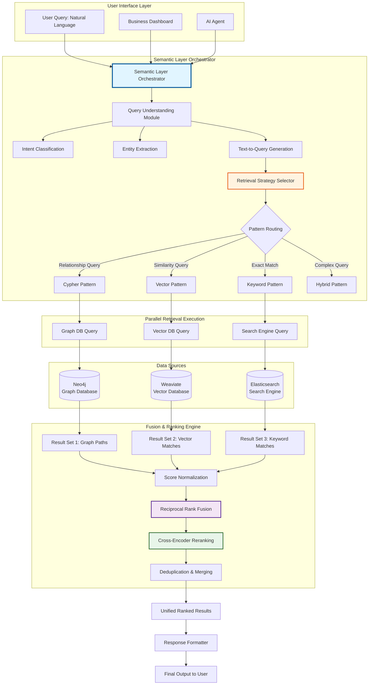
```mermaid
graph TB
    subgraph "User Interface Layer"
        A[User Query: Natural Language]
        B[Business Dashboard]
        C[AI Agent]
    end

    A --> D[Semantic Layer Orchestrator]
    B --> D
    C --> D

    subgraph "Semantic Layer Orchestrator"
        D --> E[Query Understanding Module]
        E --> F[Intent Classification]
        E --> G[Entity Extraction]
        E --> H[Text-to-Query Generation]

        H --> I[Retrieval Strategy Selector]
        I --> J{Pattern Routing}

        J -->|Relationship Query| K[Cypher Pattern]
        J -->|Similarity Query| L[Vector Pattern]
        J -->|Exact Match| M[Keyword Pattern]
        J -->|Complex Query| N[Hybrid Pattern]
    end

    subgraph "Parallel Retrieval Execution"
        K --> O[Graph DB Query]
        L --> P[Vector DB Query]
        M --> Q[Search Engine Query]
    end

    subgraph "Data Sources"
        O --> R[(Neo4j<br/>Graph Database)]
        P --> S[(Weaviate<br/>Vector Database)]
        Q --> T[(Elasticsearch<br/>Search Engine)]
    end

    R --> U[Result Set 1: Graph Paths]
    S --> V[Result Set 2: Vector Matches]
    T --> W[Result Set 3: Keyword Matches]

    subgraph "Fusion & Ranking Engine"
        U --> X[Score Normalization]
        V --> X
        W --> X

        X --> Y[Reciprocal Rank Fusion]
        Y --> Z[Cross-Encoder Reranking]
        Z --> AA[Deduplication & Merging]
    end

    AA --> AB[Unified Ranked Results]
    AB --> AC[Response Formatter]
    AC --> AD[Final Output to User]

    style D fill:#e1f5ff,stroke:#01579b,stroke-width:3px
    style I fill:#fff3e0,stroke:#e65100,stroke-width:2px
    style Y fill:#f3e5f5,stroke:#4a148c,stroke-width:2px
    style Z fill:#e8f5e9,stroke:#1b5e20,stroke-width:2px
```

---

## Retrieval Patterns

### Pattern 1: Only Cypher (Pure Graph Retrieval)

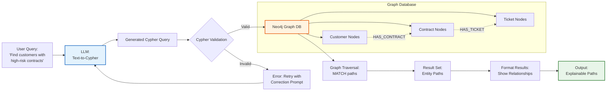
```mermaid
graph LR
    A[User Query:<br/>'Find customers with<br/>high-risk contracts'] --> B[LLM:<br/>Text-to-Cypher]

    B --> C[Generated Cypher Query]

    C --> D{Cypher Validation}
    D -->|Valid| E[Neo4j Graph DB]
    D -->|Invalid| F[Error: Retry with<br/>Correction Prompt]
    F --> B

    E --> G[Graph Traversal:<br/>MATCH paths]
    G --> H[Result Set:<br/>Entity Paths]

    H --> I[Format Results:<br/>Show Relationships]
    I --> J[Output:<br/>Explainable Paths]

    subgraph "Graph Database"
        E --> K[Customer Nodes]
        E --> L[Contract Nodes]
        E --> M[Ticket Nodes]
        K -.->|HAS_CONTRACT| L
        L -.->|HAS_TICKET| M
    end

    style B fill:#e3f2fd,stroke:#1565c0,stroke-width:2px
    style E fill:#fff3e0,stroke:#e65100,stroke-width:2px
    style J fill:#e8f5e9,stroke:#2e7d32,stroke-width:2px
```

**Key Characteristics:**
- Single retrieval method: Graph traversal only
- Requires accurate Cypher generation (69-72% accuracy)
- Returns explainable relationship paths
- Best for: Compliance, fraud detection, organizational queries

---

### Pattern 2: Cypher + Keyword

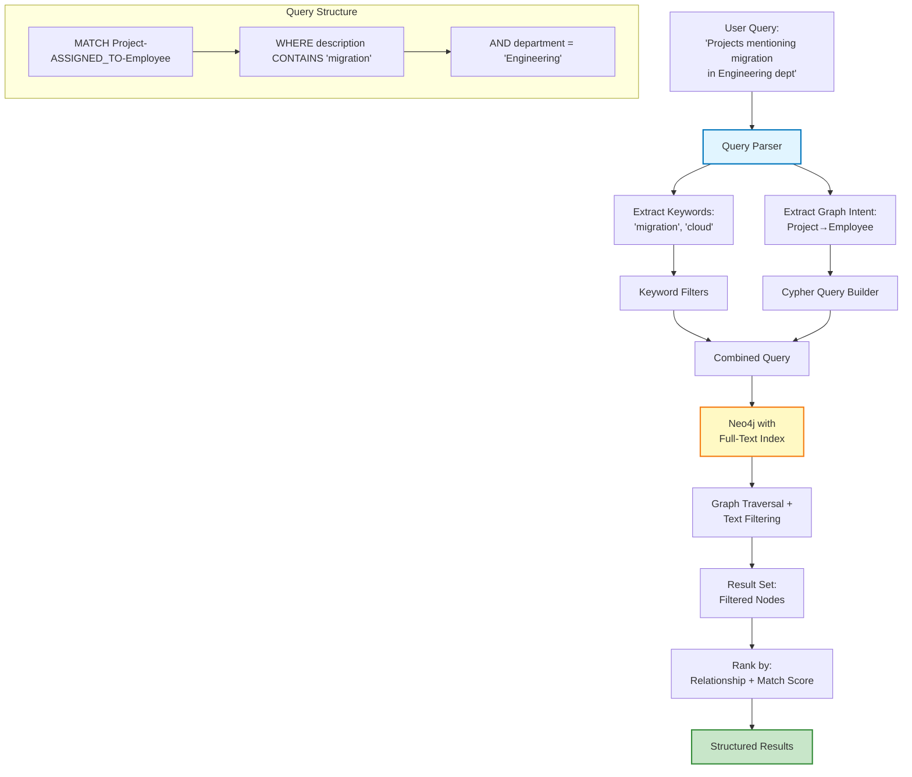
```mermaid
graph TB
    A[User Query:<br/>'Projects mentioning migration<br/>in Engineering dept'] --> B[Query Parser]

    B --> C[Extract Keywords:<br/>'migration', 'cloud']
    B --> D[Extract Graph Intent:<br/>Project→Employee]

    C --> E[Keyword Filters]
    D --> F[Cypher Query Builder]

    E --> G[Combined Query]
    F --> G

    G --> H[Neo4j with<br/>Full-Text Index]

    H --> I[Graph Traversal +<br/>Text Filtering]

    I --> J[Result Set:<br/>Filtered Nodes]

    J --> K[Rank by:<br/>Relationship + Match Score]

    K --> L[Structured Results]

    subgraph "Query Structure"
        M[MATCH Project-ASSIGNED_TO-Employee]
        N[WHERE description CONTAINS 'migration']
        O[AND department = 'Engineering']
        M --> N --> O
    end

    style B fill:#e1f5ff,stroke:#0277bd,stroke-width:2px
    style H fill:#fff9c4,stroke:#f57f17,stroke-width:2px
    style L fill:#c8e6c9,stroke:#388e3c,stroke-width:2px
```

**Key Characteristics:**
- Graph structure + keyword precision
- Requires full-text indexes on node properties
- Limited to exact term matching (no synonyms)
- Best for: Legal documents, product catalogs, compliance

---

### Pattern 3: Cypher + Semantic

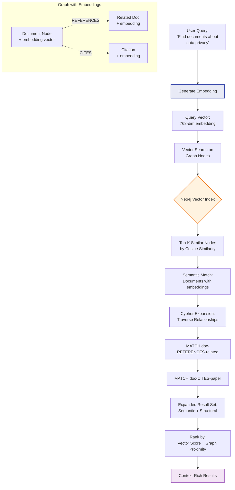
```mermaid
graph TB
    A[User Query:<br/>'Find documents about<br/>data privacy'] --> B[Generate Embedding]

    B --> C[Query Vector:<br/>768-dim embedding]

    C --> D[Vector Search on<br/>Graph Nodes]

    D --> E{Neo4j Vector Index}

    E --> F[Top-K Similar Nodes<br/>by Cosine Similarity]

    F --> G[Semantic Match:<br/>Documents with embeddings]

    G --> H[Cypher Expansion:<br/>Traverse Relationships]

    H --> I[MATCH doc-REFERENCES-related]
    I --> J[MATCH doc-CITES-paper]

    J --> K[Expanded Result Set:<br/>Semantic + Structural]

    K --> L[Rank by:<br/>Vector Score + Graph Proximity]

    L --> M[Context-Rich Results]

    subgraph "Graph with Embeddings"
        N[Document Node<br/>+ embedding vector]
        O[Related Doc<br/>+ embedding]
        P[Citation<br/>+ embedding]
        N -.REFERENCES.-> O
        N -.CITES.-> P
    end

    style B fill:#e8eaf6,stroke:#3949ab,stroke-width:2px
    style E fill:#fff3e0,stroke:#ef6c00,stroke-width:2px
    style M fill:#f3e5f5,stroke:#7b1fa2,stroke-width:2px
```

**Key Characteristics:**
- Embeddings stored on graph nodes
- Semantic similarity + relationship context
- 90% accuracy with Semantic Vector Prompting (2026)
- Best for: Knowledge graphs, scientific literature, enterprise docs

---

### Pattern 4: Cypher + Hybrid (Tri-Modal)

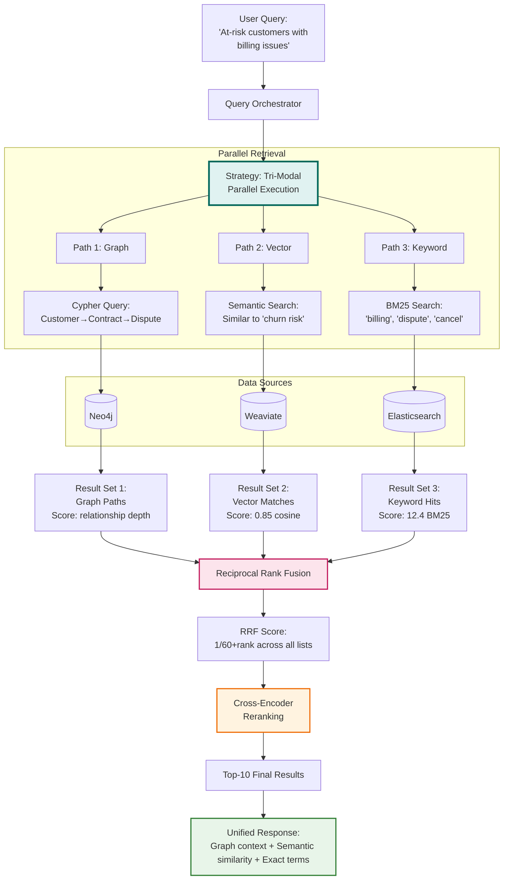
```mermaid
graph TB
    A[User Query:<br/>'At-risk customers with<br/>billing issues'] --> B[Query Orchestrator]

    B --> C[Strategy: Tri-Modal<br/>Parallel Execution]

    subgraph "Parallel Retrieval"
        C --> D[Path 1: Graph]
        C --> E[Path 2: Vector]
        C --> F[Path 3: Keyword]

        D --> G[Cypher Query:<br/>Customer→Contract→Dispute]
        E --> H[Semantic Search:<br/>Similar to 'churn risk']
        F --> I[BM25 Search:<br/>'billing', 'dispute', 'cancel']
    end

    subgraph "Data Sources"
        G --> J[(Neo4j)]
        H --> K[(Weaviate)]
        I --> L[(Elasticsearch)]
    end

    J --> M[Result Set 1:<br/>Graph Paths<br/>Score: relationship depth]
    K --> N[Result Set 2:<br/>Vector Matches<br/>Score: 0.85 cosine]
    L --> O[Result Set 3:<br/>Keyword Hits<br/>Score: 12.4 BM25]

    M --> P[Reciprocal Rank Fusion]
    N --> P
    O --> P

    P --> Q[RRF Score:<br/>1/60+rank across all lists]

    Q --> R[Cross-Encoder<br/>Reranking]

    R --> S[Top-10 Final Results]

    S --> T[Unified Response:<br/>Graph context + Semantic similarity + Exact terms]

    style C fill:#e0f2f1,stroke:#00695c,stroke-width:3px
    style P fill:#fce4ec,stroke:#c2185b,stroke-width:2px
    style R fill:#fff3e0,stroke:#ef6c00,stroke-width:2px
    style T fill:#e8f5e9,stroke:#2e7d32,stroke-width:2px
```

**Key Characteristics:**
- Maximum recall and precision (+22% NDCG, +40% recall)
- 3 parallel queries fused via RRF
- Enterprise-grade for mission-critical use cases
- Best for: Comprehensive search, agentic AI, complex analytics

---

### Pattern 5: Only Hybrid (Vector + Keyword, No Graph)

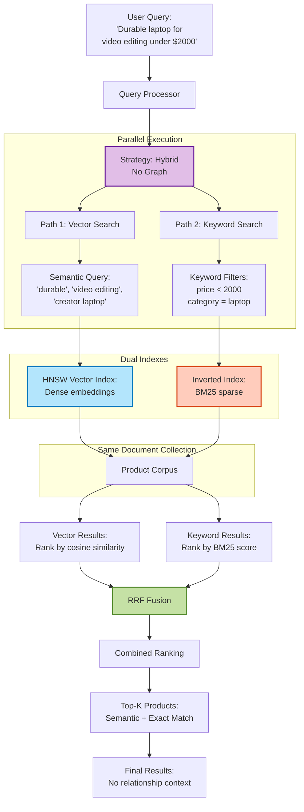
```mermaid
graph TB
    A[User Query:<br/>'Durable laptop for<br/>video editing under $2000'] --> B[Query Processor]

    B --> C[Strategy: Hybrid<br/>No Graph]

    subgraph "Parallel Execution"
        C --> D[Path 1: Vector Search]
        C --> E[Path 2: Keyword Search]

        D --> F[Semantic Query:<br/>'durable', 'video editing',<br/>'creator laptop']
        E --> G[Keyword Filters:<br/>price < 2000<br/>category = laptop]
    end

    subgraph "Dual Indexes"
        F --> H[HNSW Vector Index:<br/>Dense embeddings]
        G --> I[Inverted Index:<br/>BM25 sparse]
    end

    subgraph "Same Document Collection"
        H --> J[Product Corpus]
        I --> J
    end

    J --> K[Vector Results:<br/>Rank by cosine similarity]
    J --> L[Keyword Results:<br/>Rank by BM25 score]

    K --> M[RRF Fusion]
    L --> M

    M --> N[Combined Ranking]

    N --> O[Top-K Products:<br/>Semantic + Exact Match]

    O --> P[Final Results:<br/>No relationship context]

    style C fill:#e1bee7,stroke:#6a1b9a,stroke-width:2px
    style H fill:#b3e5fc,stroke:#0277bd,stroke-width:2px
    style I fill:#ffccbc,stroke:#d84315,stroke-width:2px
    style M fill:#c5e1a5,stroke:#558b2f,stroke-width:2px
```

**Key Characteristics:**
- Fastest implementation (4-6 weeks)
- No graph modeling required
- 80% of benefits, 20% of complexity
- Best for: Document search, e-commerce, quick-start RAG

---

## Fusion Patterns

### Fusion Pattern A: Merge (Union)

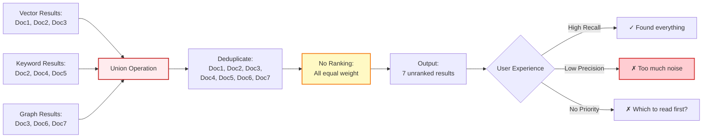
```mermaid
graph LR
    A[Vector Results:<br/>Doc1, Doc2, Doc3] --> D[Union Operation]
    B[Keyword Results:<br/>Doc2, Doc4, Doc5] --> D
    C[Graph Results:<br/>Doc3, Doc6, Doc7] --> D

    D --> E[Deduplicate:<br/>Doc1, Doc2, Doc3,<br/>Doc4, Doc5, Doc6, Doc7]

    E --> F[No Ranking:<br/>All equal weight]

    F --> G[Output:<br/>7 unranked results]

    G --> H{User Experience}
    H -->|High Recall| I[✓ Found everything]
    H -->|Low Precision| J[✗ Too much noise]
    H -->|No Priority| K[✗ Which to read first?]

    style D fill:#ffebee,stroke:#c62828,stroke-width:2px
    style F fill:#fff9c4,stroke:#f57f17,stroke-width:2px
    style J fill:#ffcdd2,stroke:#d32f2f,stroke-width:2px
```

**Use Case:** Debugging, exploration, data quality audits
**Avoid for:** Production user-facing search

---

### Fusion Pattern B: Weighted Fusion

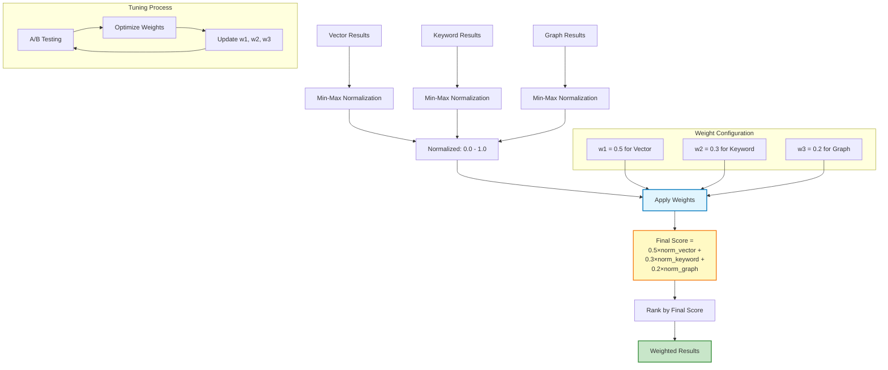
```mermaid
graph TB
    A[Vector Results] --> B[Min-Max Normalization]
    C[Keyword Results] --> D[Min-Max Normalization]
    E[Graph Results] --> F[Min-Max Normalization]

    B --> G[Normalized: 0.0 - 1.0]
    D --> G
    F --> G

    G --> H[Apply Weights]

    subgraph "Weight Configuration"
        I[w1 = 0.5 for Vector]
        J[w2 = 0.3 for Keyword]
        K[w3 = 0.2 for Graph]
    end

    I --> H
    J --> H
    K --> H

    H --> L[Final Score = <br/>0.5×norm_vector + <br/>0.3×norm_keyword + <br/>0.2×norm_graph]

    L --> M[Rank by Final Score]

    M --> N[Weighted Results]

    subgraph "Tuning Process"
        O[A/B Testing] --> P[Optimize Weights]
        P --> Q[Update w1, w2, w3]
        Q --> O
    end

    style H fill:#e1f5fe,stroke:#0277bd,stroke-width:2px
    style L fill:#fff9c4,stroke:#f57f17,stroke-width:2px
    style N fill:#c8e6c9,stroke:#388e3c,stroke-width:2px
```

**Use Case:** Domain-specific tuning, known query patterns
**Requires:** Ground truth data for weight optimization

---

### Fusion Pattern C: Reciprocal Rank Fusion (RRF)

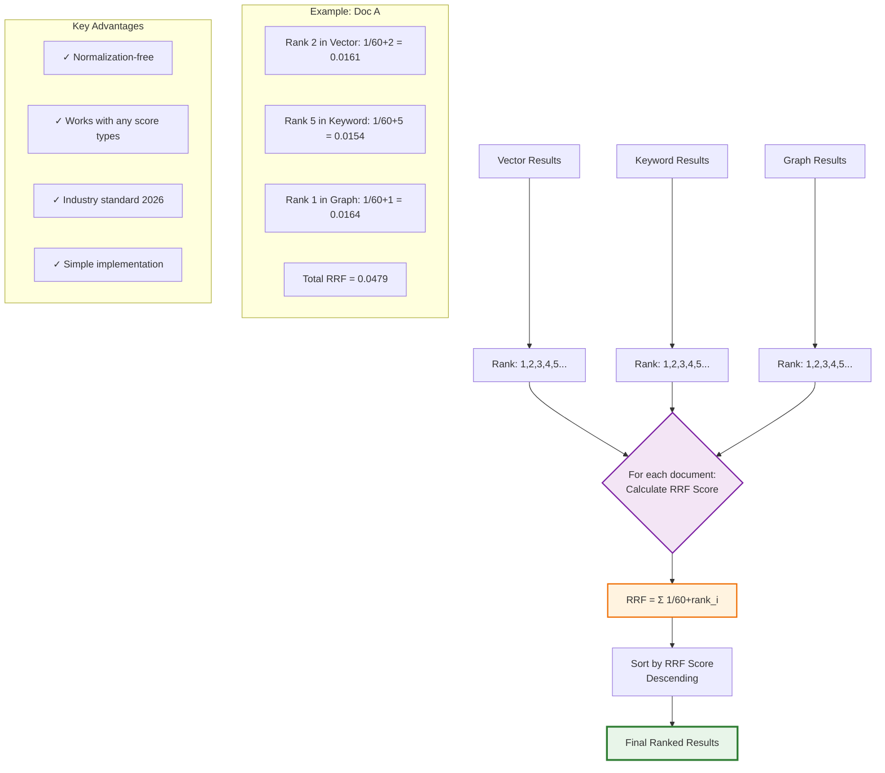
```mermaid
graph TB
    A[Vector Results] --> B[Rank: 1,2,3,4,5...]
    C[Keyword Results] --> D[Rank: 1,2,3,4,5...]
    E[Graph Results] --> F[Rank: 1,2,3,4,5...]

    B --> G{For each document:<br/>Calculate RRF Score}
    D --> G
    F --> G

    G --> H[RRF = Σ 1/60+rank_i]

    subgraph "Example: Doc A"
        I[Rank 2 in Vector: 1/60+2 = 0.0161]
        J[Rank 5 in Keyword: 1/60+5 = 0.0154]
        K[Rank 1 in Graph: 1/60+1 = 0.0164]
        L[Total RRF = 0.0479]
    end

    H --> M[Sort by RRF Score<br/>Descending]

    M --> N[Final Ranked Results]

    subgraph "Key Advantages"
        O[✓ Normalization-free]
        P[✓ Works with any score types]
        Q[✓ Industry standard 2026]
        R[✓ Simple implementation]
    end

    style G fill:#f3e5f5,stroke:#7b1fa2,stroke-width:2px
    style H fill:#fff3e0,stroke:#ef6c00,stroke-width:2px
    style N fill:#e8f5e9,stroke:#2e7d32,stroke-width:3px
```

**Use Case:** Default choice for production hybrid search
**Status:** De facto industry standard (2026)

---

### Fusion Pattern D: Two-Stage Reranking

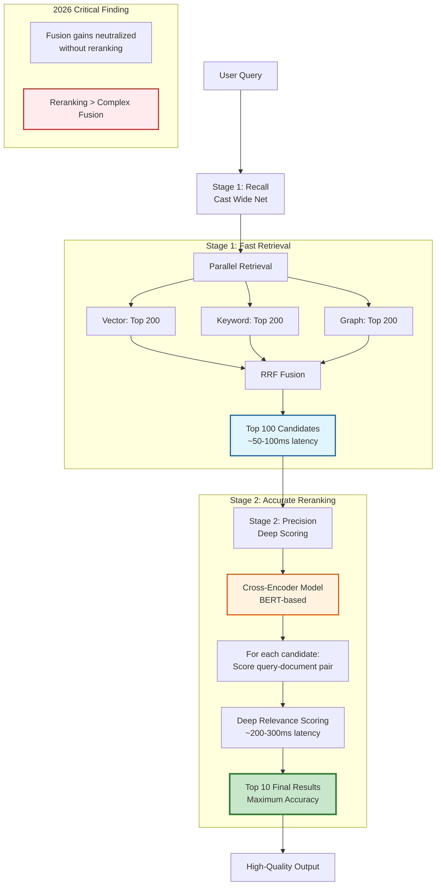
```mermaid
graph TB
    A[User Query] --> B[Stage 1: Recall<br/>Cast Wide Net]

    B --> C[Parallel Retrieval]

    subgraph "Stage 1: Fast Retrieval"
        C --> D[Vector: Top 200]
        C --> E[Keyword: Top 200]
        C --> F[Graph: Top 200]

        D --> G[RRF Fusion]
        E --> G
        F --> G

        G --> H[Top 100 Candidates<br/>~50-100ms latency]
    end

    H --> I[Stage 2: Precision<br/>Deep Scoring]

    subgraph "Stage 2: Accurate Reranking"
        I --> J[Cross-Encoder Model<br/>BERT-based]

        J --> K[For each candidate:<br/>Score query-document pair]

        K --> L[Deep Relevance Scoring<br/>~200-300ms latency]

        L --> M[Top 10 Final Results<br/>Maximum Accuracy]
    end

    M --> N[High-Quality Output]

    subgraph "2026 Critical Finding"
        O[Fusion gains neutralized<br/>without reranking]
        P[Reranking > Complex Fusion]
    end

    style H fill:#e1f5fe,stroke:#01579b,stroke-width:2px
    style J fill:#fff3e0,stroke:#e65100,stroke-width:2px
    style M fill:#c8e6c9,stroke:#2e7d32,stroke-width:3px
    style P fill:#ffebee,stroke:#c62828,stroke-width:2px
```

**Use Case:** ALWAYS in production (non-negotiable 2026)
**Performance:** +10-15% accuracy gain

---

### Fusion Pattern E: Sequential (Cascading)

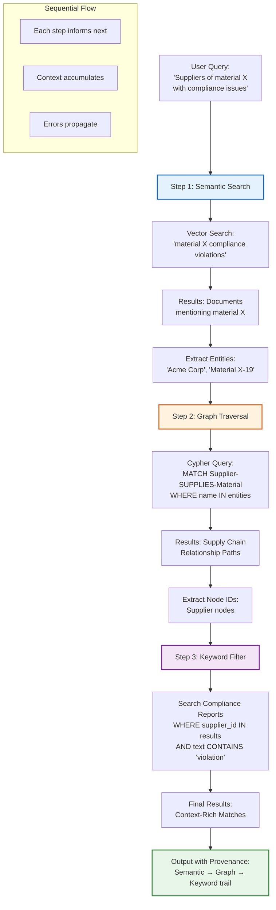
```mermaid
graph TB
    A[User Query:<br/>'Suppliers of material X<br/>with compliance issues'] --> B[Step 1: Semantic Search]

    B --> C[Vector Search:<br/>'material X compliance violations']

    C --> D[Results: Documents<br/>mentioning material X]

    D --> E[Extract Entities:<br/>'Acme Corp', 'Material X-19']

    E --> F[Step 2: Graph Traversal]

    F --> G[Cypher Query:<br/>MATCH Supplier-SUPPLIES-Material<br/>WHERE name IN entities]

    G --> H[Results: Supply Chain<br/>Relationship Paths]

    H --> I[Extract Node IDs:<br/>Supplier nodes]

    I --> J[Step 3: Keyword Filter]

    J --> K[Search Compliance Reports<br/>WHERE supplier_id IN results<br/>AND text CONTAINS 'violation']

    K --> L[Final Results:<br/>Context-Rich Matches]

    L --> M[Output with Provenance:<br/>Semantic → Graph → Keyword trail]

    subgraph "Sequential Flow"
        N[Each step informs next]
        O[Context accumulates]
        P[Errors propagate]
    end

    style B fill:#e3f2fd,stroke:#1565c0,stroke-width:2px
    style F fill:#fff3e0,stroke:#e65100,stroke-width:2px
    style J fill:#f3e5f5,stroke:#7b1fa2,stroke-width:2px
    style M fill:#e8f5e9,stroke:#2e7d32,stroke-width:2px
```

**Use Case:** Complex investigations, agentic workflows
**Trade-off:** Higher latency for better context

---

### Fusion Pattern F: RAG-Fusion (Multi-Query)

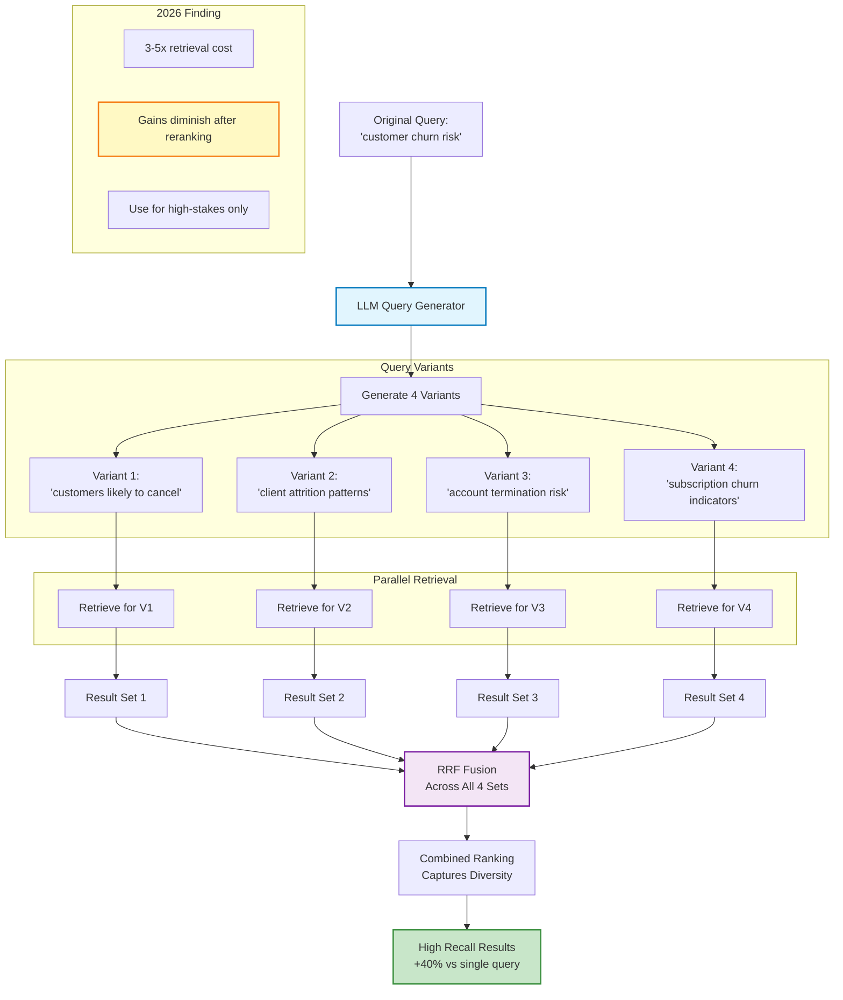
```mermaid
graph TB
    A[Original Query:<br/>'customer churn risk'] --> B[LLM Query Generator]

    B --> C[Generate 4 Variants]

    subgraph "Query Variants"
        C --> D[Variant 1:<br/>'customers likely to cancel']
        C --> E[Variant 2:<br/>'client attrition patterns']
        C --> F[Variant 3:<br/>'account termination risk']
        C --> G[Variant 4:<br/>'subscription churn indicators']
    end

    subgraph "Parallel Retrieval"
        D --> H[Retrieve for V1]
        E --> I[Retrieve for V2]
        F --> J[Retrieve for V3]
        G --> K[Retrieve for V4]
    end

    H --> L[Result Set 1]
    I --> M[Result Set 2]
    J --> N[Result Set 3]
    K --> O[Result Set 4]

    L --> P[RRF Fusion<br/>Across All 4 Sets]
    M --> P
    N --> P
    O --> P

    P --> Q[Combined Ranking<br/>Captures Diversity]

    Q --> R[High Recall Results<br/>+40% vs single query]

    subgraph "2026 Finding"
        S[3-5x retrieval cost]
        T[Gains diminish after reranking]
        U[Use for high-stakes only]
    end

    style B fill:#e1f5fe,stroke:#0277bd,stroke-width:2px
    style P fill:#f3e5f5,stroke:#7b1fa2,stroke-width:2px
    style R fill:#c8e6c9,stroke:#388e3c,stroke-width:2px
    style T fill:#fff9c4,stroke:#f57f17,stroke-width:2px
```

**Use Case:** High-stakes queries, exploratory search
**Avoid for:** High-volume scenarios (3-5x cost)

---

## Complete End-to-End Flows

### Flow 1: E-Commerce Product Search (Pattern 5 + RRF)

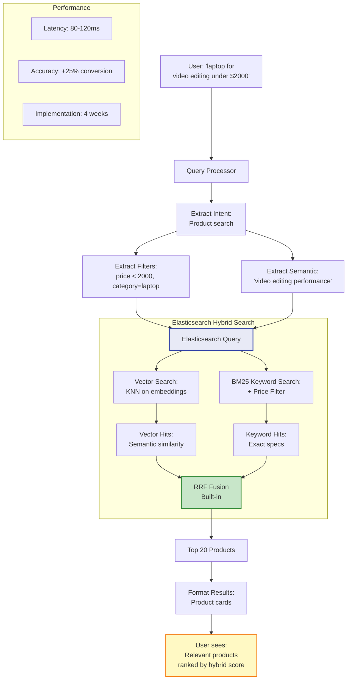
```mermaid
graph TB
    A[User: 'laptop for<br/>video editing under $2000'] --> B[Query Processor]

    B --> C[Extract Intent:<br/>Product search]
    C --> D[Extract Filters:<br/>price < 2000, category=laptop]
    C --> E[Extract Semantic:<br/>'video editing performance']

    D --> F[Elasticsearch Query]
    E --> F

    subgraph "Elasticsearch Hybrid Search"
        F --> G[Vector Search:<br/>KNN on embeddings]
        F --> H[BM25 Keyword Search:<br/>+ Price Filter]

        G --> I[Vector Hits:<br/>Semantic similarity]
        H --> J[Keyword Hits:<br/>Exact specs]

        I --> K[RRF Fusion<br/>Built-in]
        J --> K
    end

    K --> L[Top 20 Products]

    L --> M[Format Results:<br/>Product cards]

    M --> N[User sees:<br/>Relevant products<br/>ranked by hybrid score]

    subgraph "Performance"
        O[Latency: 80-120ms]
        P[Accuracy: +25% conversion]
        Q[Implementation: 4 weeks]
    end

    style F fill:#e8eaf6,stroke:#3949ab,stroke-width:2px
    style K fill:#c8e6c9,stroke:#388e3c,stroke-width:2px
    style N fill:#fff9c4,stroke:#f57f17,stroke-width:2px
```

---

### Flow 2: Financial Fraud Detection (Pattern 3 + Reranking)

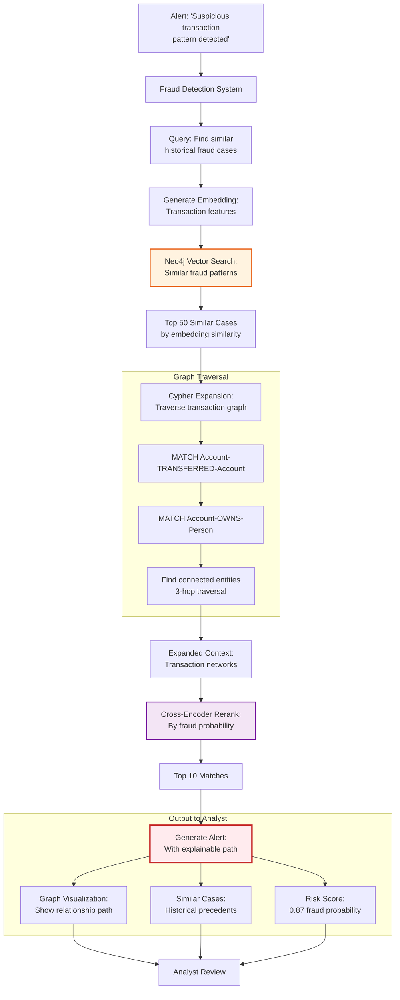
```mermaid
graph TB
    A[Alert: 'Suspicious transaction<br/>pattern detected'] --> B[Fraud Detection System]

    B --> C[Query: Find similar<br/>historical fraud cases]

    C --> D[Generate Embedding:<br/>Transaction features]

    D --> E[Neo4j Vector Search:<br/>Similar fraud patterns]

    E --> F[Top 50 Similar Cases<br/>by embedding similarity]

    F --> G[Cypher Expansion:<br/>Traverse transaction graph]

    subgraph "Graph Traversal"
        G --> H[MATCH Account-TRANSFERRED-Account]
        H --> I[MATCH Account-OWNS-Person]
        I --> J[Find connected entities<br/>3-hop traversal]
    end

    J --> K[Expanded Context:<br/>Transaction networks]

    K --> L[Cross-Encoder Rerank:<br/>By fraud probability]

    L --> M[Top 10 Matches]

    M --> N[Generate Alert:<br/>With explainable path]

    subgraph "Output to Analyst"
        N --> O[Graph Visualization:<br/>Show relationship path]
        N --> P[Similar Cases:<br/>Historical precedents]
        N --> Q[Risk Score:<br/>0.87 fraud probability]
    end

    O --> R[Analyst Review]
    P --> R
    Q --> R

    style E fill:#fff3e0,stroke:#e65100,stroke-width:2px
    style L fill:#f3e5f5,stroke:#7b1fa2,stroke-width:2px
    style N fill:#ffebee,stroke:#c62828,stroke-width:3px
```

---

### Flow 3: Customer Support Routing (Pattern 4 + RAG-Fusion)

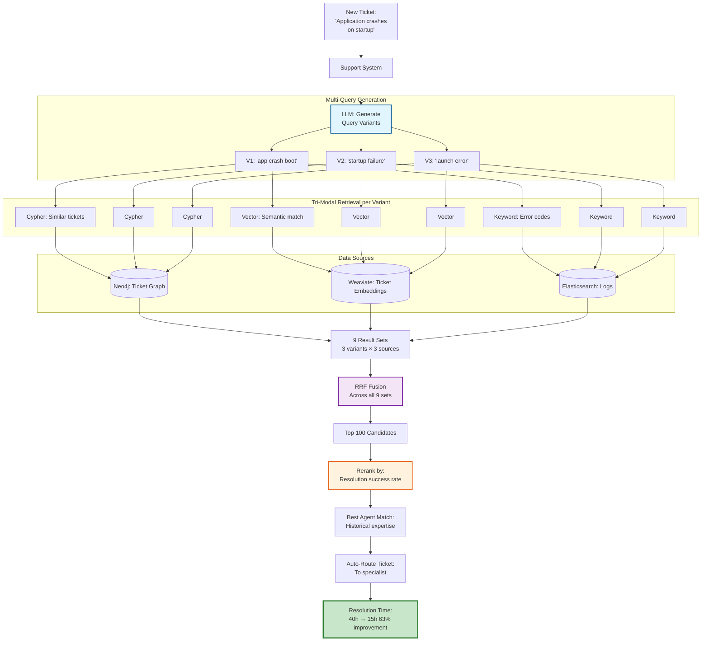
```mermaid
graph TB
    A[New Ticket:<br/>'Application crashes<br/>on startup'] --> B[Support System]

    B --> C[LLM: Generate<br/>Query Variants]

    subgraph "Multi-Query Generation"
        C --> D[V1: 'app crash boot']
        C --> E[V2: 'startup failure']
        C --> F[V3: 'launch error']
    end

    subgraph "Tri-Modal Retrieval per Variant"
        D --> G1[Cypher: Similar tickets]
        D --> H1[Vector: Semantic match]
        D --> I1[Keyword: Error codes]

        E --> G2[Cypher]
        E --> H2[Vector]
        E --> I2[Keyword]

        F --> G3[Cypher]
        F --> H3[Vector]
        F --> I3[Keyword]
    end

    subgraph "Data Sources"
        G1 --> J[(Neo4j: Ticket Graph)]
        H1 --> K[(Weaviate: Ticket Embeddings)]
        I1 --> L[(Elasticsearch: Logs)]

        G2 --> J
        H2 --> K
        I2 --> L

        G3 --> J
        H3 --> K
        I3 --> L
    end

    J --> M[9 Result Sets<br/>3 variants × 3 sources]
    K --> M
    L --> M

    M --> N[RRF Fusion<br/>Across all 9 sets]

    N --> O[Top 100 Candidates]

    O --> P[Rerank by:<br/>Resolution success rate]

    P --> Q[Best Agent Match:<br/>Historical expertise]

    Q --> R[Auto-Route Ticket:<br/>To specialist]

    R --> S[Resolution Time:<br/>40h → 15h 63% improvement]

    style C fill:#e1f5fe,stroke:#01579b,stroke-width:2px
    style N fill:#f3e5f5,stroke:#7b1fa2,stroke-width:2px
    style P fill:#fff3e0,stroke:#e65100,stroke-width:2px
    style S fill:#c8e6c9,stroke:#2e7d32,stroke-width:3px
```

---

### Flow 4: Legal Research (Sequential Pattern)

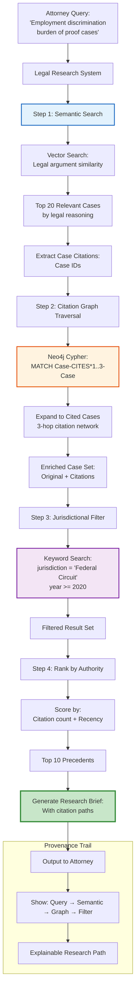
```mermaid
graph TB
    A[Attorney Query:<br/>'Employment discrimination<br/>burden of proof cases'] --> B[Legal Research System]

    B --> C[Step 1: Semantic Search]

    C --> D[Vector Search:<br/>Legal argument similarity]

    D --> E[Top 20 Relevant Cases<br/>by legal reasoning]

    E --> F[Extract Case Citations:<br/>Case IDs]

    F --> G[Step 2: Citation Graph Traversal]

    G --> H[Neo4j Cypher:<br/>MATCH Case-CITES*1..3-Case]

    H --> I[Expand to Cited Cases<br/>3-hop citation network]

    I --> J[Enriched Case Set:<br/>Original + Citations]

    J --> K[Step 3: Jurisdictional Filter]

    K --> L[Keyword Search:<br/>jurisdiction = 'Federal Circuit'<br/>year >= 2020]

    L --> M[Filtered Result Set]

    M --> N[Step 4: Rank by Authority]

    N --> O[Score by:<br/>Citation count + Recency]

    O --> P[Top 10 Precedents]

    P --> Q[Generate Research Brief:<br/>With citation paths]

    Q --> R[Output to Attorney]

    subgraph "Provenance Trail"
        R --> S[Show: Query → Semantic → Graph → Filter]
        S --> T[Explainable Research Path]
    end

    style C fill:#e3f2fd,stroke:#1565c0,stroke-width:2px
    style H fill:#fff3e0,stroke:#e65100,stroke-width:2px
    style L fill:#f3e5f5,stroke:#7b1fa2,stroke-width:2px
    style Q fill:#c8e6c9,stroke:#388e3c,stroke-width:3px
```

---

### Flow 5: Enterprise Knowledge Graph Query (Full Tri-Modal)

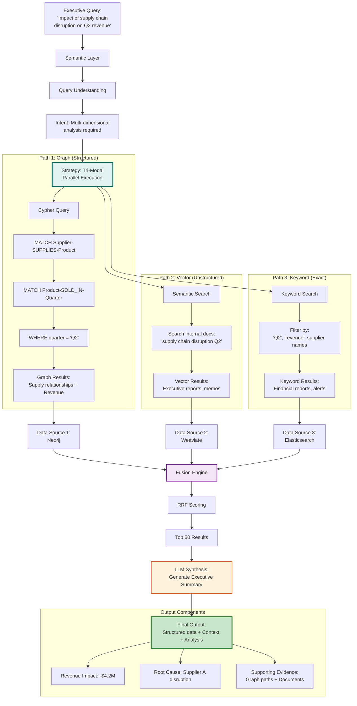
```mermaid
graph TB
    A[Executive Query:<br/>'Impact of supply chain<br/>disruption on Q2 revenue'] --> B[Semantic Layer]

    B --> C[Query Understanding]

    C --> D[Intent: Multi-dimensional<br/>analysis required]

    D --> E[Strategy: Tri-Modal<br/>Parallel Execution]

    subgraph "Path 1: Graph (Structured)"
        E --> F[Cypher Query]
        F --> G[MATCH Supplier-SUPPLIES-Product]
        G --> H[MATCH Product-SOLD_IN-Quarter]
        H --> I[WHERE quarter = 'Q2']
        I --> J[Graph Results:<br/>Supply relationships + Revenue]
    end

    subgraph "Path 2: Vector (Unstructured)"
        E --> K[Semantic Search]
        K --> L[Search internal docs:<br/>'supply chain disruption Q2']
        L --> M[Vector Results:<br/>Executive reports, memos]
    end

    subgraph "Path 3: Keyword (Exact)"
        E --> N[Keyword Search]
        N --> O[Filter by:<br/>'Q2', 'revenue', supplier names]
        O --> P[Keyword Results:<br/>Financial reports, alerts]
    end

    J --> Q[Data Source 1:<br/>Neo4j]
    M --> R[Data Source 2:<br/>Weaviate]
    P --> S[Data Source 3:<br/>Elasticsearch]

    Q --> T[Fusion Engine]
    R --> T
    S --> T

    T --> U[RRF Scoring]

    U --> V[Top 50 Results]

    V --> W[LLM Synthesis:<br/>Generate Executive Summary]

    W --> X[Final Output:<br/>Structured data + Context + Analysis]

    subgraph "Output Components"
        X --> Y[Revenue Impact: -$4.2M]
        X --> Z[Root Cause: Supplier A disruption]
        X --> AA[Supporting Evidence:<br/>Graph paths + Documents]
    end

    style E fill:#e0f2f1,stroke:#00695c,stroke-width:3px
    style T fill:#f3e5f5,stroke:#7b1fa2,stroke-width:2px
    style W fill:#fff3e0,stroke:#e65100,stroke-width:2px
    style X fill:#c8e6c9,stroke:#2e7d32,stroke-width:3px
```

---

## Comparison Matrix: All Patterns

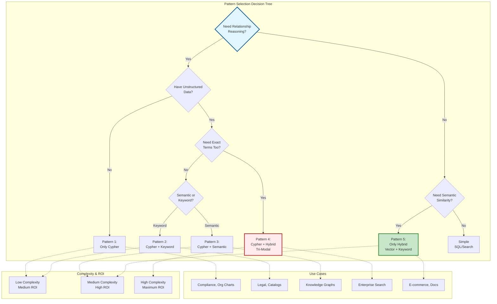
```mermaid
graph TB
    subgraph "Pattern Selection Decision Tree"
        A{Need Relationship<br/>Reasoning?}

        A -->|Yes| B{Have Unstructured<br/>Data?}
        A -->|No| C{Need Semantic<br/>Similarity?}

        B -->|Yes| D{Need Exact<br/>Terms Too?}
        B -->|No| E[Pattern 1:<br/>Only Cypher]

        D -->|Yes| F[Pattern 4:<br/>Cypher + Hybrid<br/>Tri-Modal]
        D -->|No| G{Semantic or<br/>Keyword?}

        G -->|Semantic| H[Pattern 3:<br/>Cypher + Semantic]
        G -->|Keyword| I[Pattern 2:<br/>Cypher + Keyword]

        C -->|Yes| J[Pattern 5:<br/>Only Hybrid<br/>Vector + Keyword]
        C -->|No| K[Simple<br/>SQL/Search]
    end

    subgraph "Use Cases"
        E -.-> L[Compliance, Org Charts]
        I -.-> M[Legal, Catalogs]
        H -.-> N[Knowledge Graphs]
        F -.-> O[Enterprise Search]
        J -.-> P[E-commerce, Docs]
    end

    subgraph "Complexity & ROI"
        E -.-> Q[Low Complexity<br/>Medium ROI]
        I -.-> Q
        H -.-> R[Medium Complexity<br/>High ROI]
        J -.-> R
        F -.-> S[High Complexity<br/>Maximum ROI]
    end

    style A fill:#e1f5fe,stroke:#01579b,stroke-width:3px
    style F fill:#ffebee,stroke:#c62828,stroke-width:3px
    style J fill:#c8e6c9,stroke:#388e3c,stroke-width:3px
```

---

## Performance Comparison

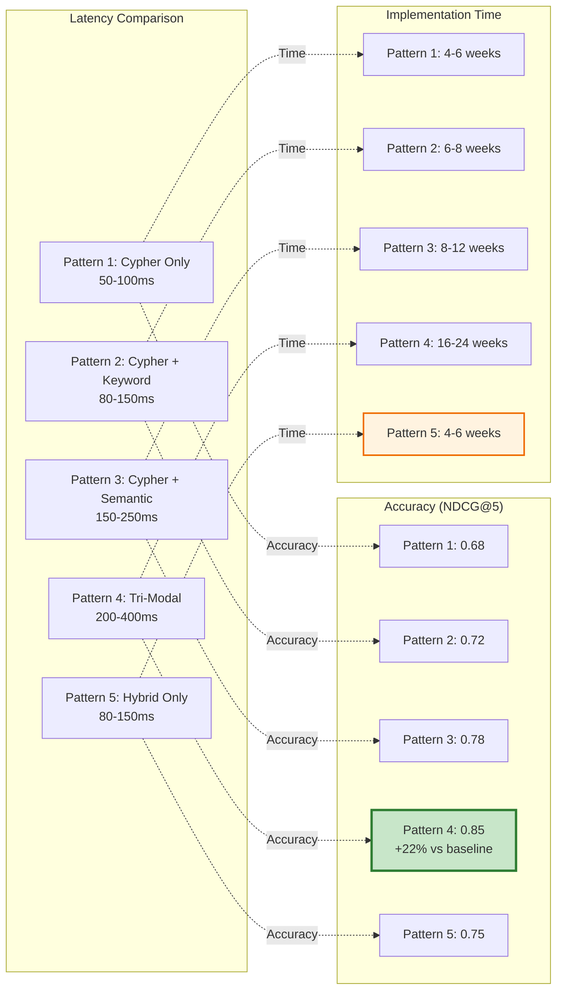
```mermaid
graph LR
    subgraph "Latency Comparison"
        A[Pattern 1: Cypher Only<br/>50-100ms]
        B[Pattern 2: Cypher + Keyword<br/>80-150ms]
        C[Pattern 3: Cypher + Semantic<br/>150-250ms]
        D[Pattern 4: Tri-Modal<br/>200-400ms]
        E[Pattern 5: Hybrid Only<br/>80-150ms]
    end

    subgraph "Accuracy (NDCG@5)"
        F[Pattern 1: 0.68]
        G[Pattern 2: 0.72]
        H[Pattern 3: 0.78]
        I[Pattern 4: 0.85<br/>+22% vs baseline]
        J[Pattern 5: 0.75]
    end

    subgraph "Implementation Time"
        K[Pattern 1: 4-6 weeks]
        L[Pattern 2: 6-8 weeks]
        M[Pattern 3: 8-12 weeks]
        N[Pattern 4: 16-24 weeks]
        O[Pattern 5: 4-6 weeks]
    end

    A -.Accuracy.-> F
    B -.Accuracy.-> G
    C -.Accuracy.-> H
    D -.Accuracy.-> I
    E -.Accuracy.-> J

    A -.Time.-> K
    B -.Time.-> L
    C -.Time.-> M
    D -.Time.-> N
    E -.Time.-> O

    style I fill:#c8e6c9,stroke:#2e7d32,stroke-width:3px
    style O fill:#fff3e0,stroke:#ef6c00,stroke-width:2px
```

---

## Technology Stack Visualization

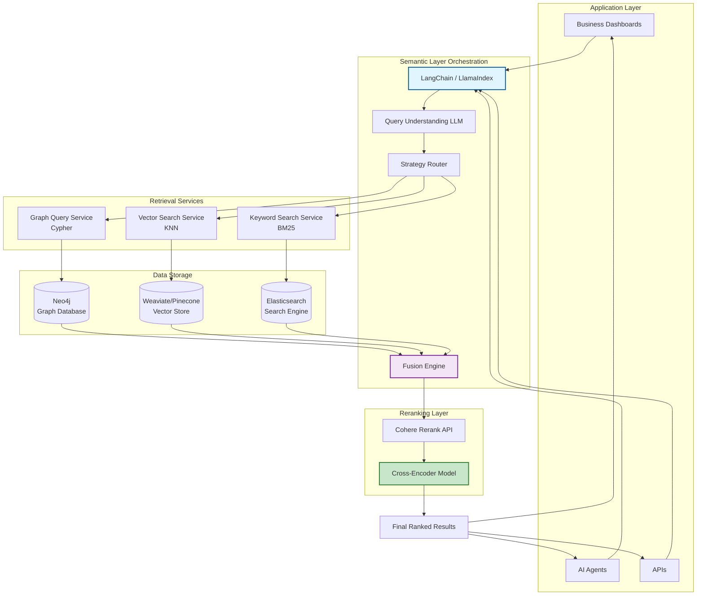
```mermaid
graph TB
    subgraph "Application Layer"
        A[Business Dashboards]
        B[AI Agents]
        C[APIs]
    end

    subgraph "Semantic Layer Orchestration"
        D[LangChain / LlamaIndex]
        E[Query Understanding LLM]
        F[Strategy Router]
        G[Fusion Engine]
    end

    subgraph "Retrieval Services"
        H[Graph Query Service<br/>Cypher]
        I[Vector Search Service<br/>KNN]
        J[Keyword Search Service<br/>BM25]
    end

    subgraph "Data Storage"
        K[(Neo4j<br/>Graph Database)]
        L[(Weaviate/Pinecone<br/>Vector Store)]
        M[(Elasticsearch<br/>Search Engine)]
    end

    subgraph "Reranking Layer"
        N[Cohere Rerank API]
        O[Cross-Encoder Model]
    end

    A --> D
    B --> D
    C --> D

    D --> E
    E --> F
    F --> H
    F --> I
    F --> J

    H --> K
    I --> L
    J --> M

    K --> G
    L --> G
    M --> G

    G --> N
    N --> O

    O --> P[Final Ranked Results]

    P --> A
    P --> B
    P --> C

    style D fill:#e1f5fe,stroke:#01579b,stroke-width:2px
    style G fill:#f3e5f5,stroke:#7b1fa2,stroke-width:2px
    style O fill:#c8e6c9,stroke:#2e7d32,stroke-width:2px
```

---

## Deployment Architecture (Production)

```mermaid
graph TB
    subgraph "Load Balancer"
        A[NGINX / CloudFlare]
    end

    subgraph "API Gateway"
        B[Kong / AWS API Gateway]
    end

    subgraph "Semantic Layer Cluster"
        C[SL Instance 1]
        D[SL Instance 2]
        E[SL Instance 3]
        F[Redis Cache]
    end

    subgraph "Data Layer - High Availability"
        G[Neo4j Cluster<br/>3 read replicas]
        H[Weaviate Cluster<br/>Sharded]
        I[Elasticsearch Cluster<br/>3 nodes]
    end

    subgraph "Supporting Services"
        J[LLM API<br/>Claude Opus 4.6]
        K[Embedding API<br/>Cohere Embed]
        L[Rerank API<br/>Cohere Rerank]
    end

    subgraph "Monitoring & Observability"
        M[Prometheus]
        N[Grafana]
        O[ELK Stack]
    end

    A --> B
    B --> C
    B --> D
    B --> E

    C --> F
    D --> F
    E --> F

    C --> G
    C --> H
    C --> I
    D --> G
    D --> H
    D --> I
    E --> G
    E --> H
    E --> I

    C --> J
    C --> K
    C --> L

    C --> M
    D --> M
    E --> M

    M --> N
    M --> O

    style B fill:#e1f5fe,stroke:#01579b,stroke-width:2px
    style F fill:#fff3e0,stroke:#ef6c00,stroke-width:2px
    style M fill:#c8e6c9,stroke:#388e3c,stroke-width:2px
```

---

## Cost-Benefit Analysis Flow

```mermaid
graph TB
    A[Pattern Selection] --> B{Evaluate Criteria}

    B --> C[Use Case Complexity]
    B --> D[Implementation Budget]
    B --> E[Time to Market]
    B --> F[Accuracy Requirements]

    C --> G{Decision Matrix}
    D --> G
    E --> G
    F --> G

    subgraph "Quick Win Path"
        G -->|Low Budget<br/>Fast TTM| H[Pattern 5:<br/>Only Hybrid]
        H --> I[4-6 weeks<br/>$100K investment]
        I --> J[+25% accuracy<br/>450% ROI Year 1]
    end

    subgraph "Medium Investment Path"
        G -->|Medium Budget<br/>Specific Use Case| K[Pattern 2 or 3:<br/>Cypher + X]
        K --> L[8-12 weeks<br/>$200K investment]
        L --> M[+35% accuracy<br/>Explainability]
    end

    subgraph "Enterprise Path"
        G -->|High Budget<br/>Max Accuracy| N[Pattern 4:<br/>Tri-Modal]
        N --> O[16-24 weeks<br/>$500K-$1M investment]
        O --> P[+50% accuracy<br/>Full capabilities]
    end

    J --> Q[Business Outcome]
    M --> Q
    P --> Q

    Q --> R[Measure KPIs]
    R --> S{Meet Targets?}

    S -->|Yes| T[Scale & Optimize]
    S -->|No| U[Iterate Strategy]

    U --> A

    style H fill:#c8e6c9,stroke:#388e3c,stroke-width:3px
    style K fill:#fff3e0,stroke:#ef6c00,stroke-width:2px
    style N fill:#ffebee,stroke:#c62828,stroke-width:2px
```

---

## Migration Path: From Legacy to Hybrid

```mermaid
graph LR
    A[Current State:<br/>SQL-only Search] --> B[Phase 1:<br/>Add Vector Search<br/>4 weeks]

    B --> C[Hybrid: Vector + Keyword<br/>Pattern 5]

    C --> D{Measure Improvement}

    D -->|+25% accuracy| E[Phase 2:<br/>Add Reranking<br/>6 weeks]

    E --> F[Two-Stage Pipeline]

    F --> G{Business Need<br/>Relationships?}

    G -->|Yes| H[Phase 3:<br/>Model Graph<br/>12 weeks]
    G -->|No| I[Optimize & Scale]

    H --> J[Add Neo4j:<br/>Pattern 3 or 4]

    J --> K[Full Tri-Modal<br/>Semantic Layer]

    K --> L[Enterprise-Grade<br/>Retrieval]

    I --> M[Production Hardening]
    L --> M

    M --> N[Continuous Optimization]

    subgraph "Investment Timeline"
        O[Month 1-2: $100K]
        P[Month 3-4: +$50K]
        Q[Month 5-10: +$300K]
        R[Total: $450K over 10 months]
    end

    subgraph "ROI Timeline"
        S[Month 2: +20% accuracy]
        T[Month 4: +35% accuracy]
        U[Month 10: +50% accuracy]
        V[Year 1 ROI: 450-600%]
    end

    style C fill:#c8e6c9,stroke:#388e3c,stroke-width:2px
    style F fill:#fff3e0,stroke:#ef6c00,stroke-width:2px
    style K fill:#e1f5fe,stroke:#01579b,stroke-width:3px
```

---

## Usage Instructions

### How to Use These Diagrams:

1. **In Markdown Viewers:**
   - GitHub, GitLab, Notion, Obsidian automatically render Mermaid
   - Copy-paste code blocks directly into your documents

2. **In Presentations:**
   - Use [Mermaid Live Editor](https://mermaid.live) to export as PNG/SVG
   - Import images into PowerPoint, Google Slides, Keynote

3. **In Documentation:**
   - Include in README.md, technical specs, architecture docs
   - Diagrams update automatically when code changes

4. **For Stakeholders:**
   - **Executives:** Show Overall Architecture, Cost-Benefit, ROI flows
   - **Technical Teams:** Deep-dive into specific patterns
   - **Product Managers:** Use migration path and use case flows

### Customization:

All diagrams are editable. To modify:
1. Copy Mermaid code block
2. Edit in [Mermaid Live Editor](https://mermaid.live)
3. Export or copy updated code back

### Legend:

- **Blue boxes:** Query processing / orchestration
- **Orange boxes:** Data sources / retrieval
- **Purple boxes:** Fusion / ranking
- **Green boxes:** Final results / success states
- **Red boxes:** Critical findings / warnings
- **Yellow boxes:** Intermediate processing

---

**Created:** April 15, 2026
**Version:** 1.0
**Maintainer:** Enterprise Architecture Team
